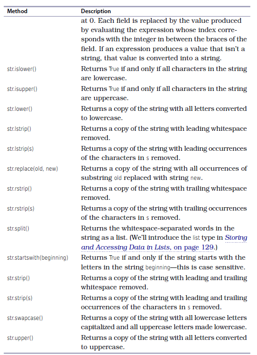

# Week 3 
## Week 3 Topics
- Review Strings
- String Methods
- Making Choices/Flow Control/Conditionals
- Data Structures (lists, tuples)
- Repeating code using loops


## Strings Review

### String, integer, and float deceleration 

```python
my_str = 'EAS503'
my_int = 113
my_float = 92.3
```


### Basic string manipulation 

```python
my_str * 10

x = '-'
x * 10

line1 = 'This is the first line.\n'
line2 = 'This is the second line.'
lines = line1 + line2

line = 'This is the first line.\n'
line += 'This is the second line.'
```

### String formatting
- Two ways
	- str.format()
	- f-string

```python
class_number = 'EAS503'
class_size = 113
class_average = 92.3

# Example 1
str_format = '{}'.format(class_number)
f_string = f'{class_number}'

print(str_format)
print(f_string)

# Example 2
str_format = 'The course number is {}'.format(class_number)
f_string = f'The course number is {class_number}'

print(str_format)
print(f_string)


# Example 3 use index
str_format = 'The course number is {}. It has {} students.'.format(class_number, class_size)
str_format = 'The course number is {0}. It has {1} students.'.format(class_number, class_size)
f_string = f'The course number is {class_number}. It has {class_size} students.'

print(str_format)
print(f_string)


# Example 4 change index
str_format = 'The course number is {1}. It has {0} students.'.format(class_number, class_size)
f_string = f'The course number is {class_size}. It has {class_number} students.'

print(str_format)
print(f_string)

# Example 5 adding a float
str_format = 'The course number is {0}. It has {1} students. The class average is {2}'.format(class_number, class_size, class_average)
f_string = f'The course number is {class_size}. It has {class_number} students. The class average is {class_average}.'

print(str_format)
print(f_string)

# Example 6 specify number of spaces to use -- width
str_format = 'The course number is {0:10}. It has {1:10} students. The class average is {2:10}'.format(class_number, class_size, class_average)
f_string = f'The course number is {class_size:10}. It has {class_size:10} students. The class average is {class_average:10}.'

print(str_format)
print(f_string)


# Example 7 right align
str_format = 'The course number is {0:>10}. It has {1:>10} students. The class average is {2:>10}'.format(class_number, class_size, class_average)
f_string = f'The course number is {class_size:>10}. It has {class_size:>10} students. The class average is {class_average:>10}.'

print(str_format)
print(f_string)


# Example 7 left align
str_format = 'The course number is {0:<10}. It has {1:<10} students. The class average is {2:<10}'.format(class_number, class_size, class_average)
f_string = f'The course number is {class_number:<10}. It has {class_size:<10} students. The class average is {class_average:<10}.'

print(str_format)
print(f_string)


# Example 8 center align
str_format = 'The course number is {0:<10}. It has {1:<10} students. The class average is {2:<10}'.format(class_number, class_size, class_average)
f_string = f'The course number is {class_number:<10}. It has {class_size:<10} students. The class average is {class_average:<10}.'

print(str_format)
print(f_string)

```


- https://scipython.com/book/chapter-2-the-core-python-language-i/string-representation-of-integers-with-comma-separated-thousands/
```python
title = '|' + '{:^51}'.format('Cereal Yields (kg/ha)') + '|'
line = '+' + '-'*15 + '+' + ('-'*8 + '+')*4
row = '| {:<13} |' + ' {:6,d} |'*4
header = '| {:^13s} |'.format('Country') + (' {:^6d} |'*4).format(1980, 1990,
                                                                  2000, 2010)
print('+' + '-'*(len(title)-2) + '+',
      title,
      line,
      header,
      line,
      row.format('China', 2937, 4321, 4752, 5527),
      row.format('Germany', 4225, 5411, 6453, 6718),
      row.format('United States', 3772, 4755, 5854, 6988),
      line,
      sep='\n')
```


## String methods




## Making Choices/Flow Control/Conditionals

- So far we have only written small programs that are a sequence of instructions. Sometimes you have to alter the sequential flow of a program to suit the needs of a particular situation.
- When strings are compared, they are compared lexicographic, meaning strings are put into alphabetical order and uppercase comes before lowercase.
- The conditional operator converts the conditional into a boolean, which is a basic Python data type.
- `bool` datatype only has two values: `True` or `False`
- There are only three Boolean operators: `and`, `or`, and `not`.

### Truthiness and Falsiness 
- Things that are false on their own
	- `None` (basic data type)
	- `False` (basic data type)
	- Any empty sequence: `''`, `[]`, `()`
	- Any zero value: 0, 0.0
	- Anything whose `len()` returns 0
	- Empty objects
	- Everything else is True 
	  

### Boolean Operators

- Assume `a=1` and `b=1`

| Boolean Operators | What it does?                                | Example       |
|----|---------------------------------------------|---------------|
| == | True if a has the same value as b           | a == b #True  |
| != | True if a does not have the same value as b | a != b #False |
| >  | True if a is greater than b                 | a > b # False |
| <  | True if a is less than b                    | a < b # False |
| >= | True if a is greater than or equal to b     | a >= b # True |
| <= | True if a is less than or equal to b        | a <= b # True |

### Logical Operators

| Operator | What it does?                                        | Example                                                                   |
|----------|------------------------------------------------------|---------------------------------------------------------------------------|
| `and`    | True if both a AND b are true (logical conjunction)  | if is_teacher and is_active:   print('You can access')                    |
| `or`     | True if either a OR b are true (logical disjunction) | if is_superuser or (is_teacher and is active):    print('You can access') |
| `not`    | True if the opposite of a is true (logical negation) | if not is_superuser:   print('You cannot access')    


### Examples
```python

not True
not False

True and True
False and False
True and False
False and True


True or True
False or False
True or False
False or True

```


```python
cold = True
windy = False

(not cold) and windy # It is not cold and windy

not (cold and windy) # 


```


### Relational Operators
- `==` Equal to 
- `!=` Not equal to
- `<` Less than
- `>` Greater than
- `<=` Less than or equal to
- `>=` Greater than or equal to

- These operators evaluate to True or False depending on the values you give them.
- Conditionals are used to instruct computer to make a decision. 

```python
45 > 34
45 > 79
45 < 79
45 < 34

23.1 >= 23
23.1 >= 23.1
23.1 <= 23.1
23.1 <= 23

67.3 == 87
67.3 == 67
67.0 == 67
67.0 != 67
67.0 != 23

```
###  Combining Comparisons

```python
x = 2
y = 5
z = 7
x < y and y < z

(x < y) and (y < z) # better

```

```python
x = 3
(1 < x) and (x <= 5)

x = 7
(1 < x) and (x <= 5)


x = 3 
1 < x <= 5 # You can chain comparisons

3 < 5 != True 
(3 < 5) and (5 != True)

3 < 5 != False
(3 < 5) and (5 != False)
```

### String Comparisons
```python
'A' < 'a'
'A' > 'Z'
'abc' < 'abd'
'abc' < 'abcd' # shorter is less

```

```python
'Jan' in '01 Jan 1838'

'Feb' in '01 Jan 1838'

'a' in 'abc'

'A' in 'abc'

```


### Choosing which statements to execute

```Python
if some condition is True:
	do something
elif some other condition is True: # else if 
	do something
elif some other condition is True: # else if 
	do something
elif some other condition is True: # else if 
	do something
else:
	do something 
```
- colons are important and indentation matters
- can have many elif tests
- do not need else
- conditions can be nested


#### Example
| pH Level | Solution Category |
|----------|-------------------|
| 0-4      | Strong acid       |
| 5-6      | Weak acid         |
| 7        | Neutral           |
| 8-9      | Weak base         |
| 10-14    | Strong base       |

```python
ph = float(input('Enter the pH level: '))
if ph < 7.0:
	print(ph, " is acidic.") #indentation important
```

```python
ph = float(input('Enter the pH level: '))
if ph < 7.0:
	print(ph, " is acidic.")
	print('You should be careful with that!') #indentation is important
```


```python
ph = float(input('Enter the pH level: '))
if ph < 7.0:
	print(ph, " is acidic.") #indentation important

if ph > 7.0:
	print(ph, " is basic.") 
```

```python
ph = float(input('Enter the pH level: '))
if ph < 7.0:
	print(ph, " is acidic.") #indentation important
elif ph > 7.0:
	print(ph, " is basic.") 
```

```python
ph = float(input('Enter the pH level: '))
if ph < 7.0:
	ph = 8.0 #indentation important

if ph > 7.0:
	print(ph, " is basic.") 
```


```python
ph = float(input('Enter the pH level: '))
if ph < 7.0:
	ph = 8.0  #indentation important
elif ph > 7.0:
	print(ph, " is basic.") 
```


```python
ph = float(input('Enter the pH level: '))
if ph < 7.0:
	ph = 8.0  #indentation important
elif ph > 7.0:
	print(ph, " is basic.") 
```

```python
compound = input('Enter the compound: ')
if compound == 'H20':
	print('Water')
elif compound == 'NH3':
	print('Ammonia')
elif compound == 'CH4':
	print('Methane')
else:
	print('Unknown compound')


```


#### Nested if statements
```python
value = input('Enter the pH level: ')
if len(value) > 0:
	ph = float(value) 
	if ph < 7.0:
		print(ph, " is acidic.")
	elif ph > 7.0:
		print(ph, " is basic.")
	else:
		print(ph, " is neutral.")

else:
	print('No pH value was given!')

```


```python
if age < 45:
	if bmi < 22.0:
		risk = 'low'
	else:
		risk = 'medium'
else:
	if bmi < 22.0:
		risk = 'medium'
	else:
		risk = 'high'

```

```python
young = age < 45
slim = bmi < 22.0
if young:
	if slim:
		risk = 'low'
	else:
		risk = 'medium'
else:
	if slim:
		risk = 'medium'
	else:
		risk = 'high'
```

```python
young = age < 45
slim = bmi < 22.0
if young and slim:
	risk = 'low'
elif young and not slim :
	risk = 'medium'
elif not young and slim:
	risk = 'medium'
elif not you and not slim:
	risk = 'high'
```

- What is wrong with the following code?
```python
ph = 2
if ph < 7.0:
	print(ph, ' is acidic')
elif ph < 3.0:
	print(ph, ' is VERY acidic! Be careful.')
```


## Data Structures (lists, tuples)
- So far we have covered the following data types: `int`, `float`, and `bool`. Now we will
cover `list`, `tuple`, `dict`, and `set`. 
- Data types in Python can be classified as `mutable` and `immutable`. 
	- Immutable data types are: `int`, `float`, `bool`, and `tuple`
	- Mutable data types are: `list`, `tuple`, `dict`, and `set`
	- NOTE: Immutable data types are passed to a function using `pass-by-value`. Mutable data types are 
	passed to a function as a reference. This means that changes made to mutable data types persist outside
	of the function. 

### List
- `list` is a container for storing a sequence of values. The values can be of different type. When the values are all `int`, `float`, or `bool`, you can use special functions. 

#### List Index -- starts at 0
```python
whales = [5, 4, 7, 3, 2, 3, 2, 6, 4, 2, 1, 7, 1, 3]
```

#### Creating a list
```python
grades = ['A', 'B', 'C', 'D', 'F']
```

#### Accessing a list
```python
grades[0]
``` 

#### Slicing a list
```python
grades[2:4]
grades[1::2]
grades[-1]
grades[::-1]
```

#### Reassigning a list
```python
grades = ['A', 'B', 'C', 'D', 'F']
grades[0] = 'a'
grades[1:2] = 'a'
grades[2:] = ['d', 'f']
```

#### Deleting from a list
```python
grades = ['A', 'B', 'C', 'D', 'F']
del grades[0]
del grades[1:3]
del grades
```

#### Concatenate lists
```python
grades1 = ['A', 'B', 'C']
grades2 = ['D', 'F']
grades = grades1 + grades2
```

#### Multiplication
```python
grades = ['A', 'B', 'C', 'D', 'F']
grades *= 3

```

#### Can store different data types
- But you will lose some processing functionality
```python
my_list = ['A', 1, 'Spam', True]
my_list2 = [['John', [55, 65, 86]], ['Jane', [70, 80, 80]]
```

#### Built-in List methods
- `len()` calculate length of list
- `max()` calculate max of list
- `min()` calculate min of list
- `sum()` calculate sum of list
- `sorted()` return a sorted list
- `list()` cast to type list -- convert tuple to list or a generator to list
- `any()` return `True` if the truthiness of any value is `True` in the list
- `all()` return `True` if the truthiness of all the values is `True` in the list

```python
numbers = [3, 4, 8, 9, 5, 6, 7, 0, 1, 2, 10, 11, 12]
len(numbers)
max(numbers)
min(numbers)
sum(numbers)
sorted(numbers)
list(numbers)
any(numbers)
all(numbers)
```
```python
booleans = [True, False, True]
any(booleans)
all(booleans)
```

```python
booleans = [True, True, True]
any(booleans)
all(booleans)
```

#### List methods (functions)
- `append()` - add an element to end of list
- `insert()` - insert an element to the list at the specified location
- `remove()` - remove the element 
- `pop()` - remove the last element in the list; also returns the value; you can save this to another variable
- `clear()` - empty the list
- `index()` - return position of first matching element
- `count()` - return the number of elements in the list
- `sort()` - sort the list in place 
- `reverse()` - reverse the list in place


```python
grades = ['A', 'B', 'C']
grades.append('D')
grades.insert(4, 'F')
grades.remove(2)
grades.pop()
grades.index('C')
grades.count() # len(grades)
grades.sort()
grades.reverse()
```

#### List unpacking 
```python
a, b = [3,4]
```

## Repeating code using loops

```
for <ele> in <sequence>:
	<body>
```

- The loop index variable `ele` takes on each successive value in the sequence, and the statements in the body of the loop are executed once for each value.
- For loops have a limitation -- you have to know how many times you are looping -- it is a definite loop. The number of iterations is determined when the loop starts. If you do not know how many times you will be looping, use a while loop, which is an indefinite loop that will continue to loop until its condition is no longer true.

```
while <condition>
	<body>
```

- Loop is controlled using `break` and `continue`. 


```python
range(start:stop:step) # [start:step:stop)

```


```python
values = [4, 10, 3, 8, -6]
for i in range(len(values)):
	print(i)

```


```python
values = [4, 10, 3, 8, -6]
for i in range(len(values)):
	print(i, values[i])

```

```python
values = [4, 10, 3, 8, -6]
for i in range(len(values)):
	print(i, values[i])

```

```python
values = [4, 10, 3, 8, -6]
for index, value in enumerate(values):
	print(index, value)

```


```python
values = [4, 10, 3, 8, -6]
for i in range(len(values)):
	values[i] = values[i] * 2

```

```python
metals = ['Li', 'Na', 'K']
weights = [6.941, 22.98976928, 39.0983]
for i in range(len(metals)):
	print(metals[i], weights[i])

```

```python
metals = ['Li', 'Na', 'K']
weights = [6.941, 22.98976928, 39.0983]
for metal, weight in zip(metals, weights):
	print(metal, weight)

```


```python
elements = [['Li', 'Na', 'K'], ['F', 'Cl', 'Br']]
for inner_list in elements:
	for item in inner_list:
		print(item)
```

```python
info = [['Isaac Newton', 1643, 1727],
	['Charles Darwin', 1809, 1882],
	['Alan Turing', 1912, 1954, 'alan@bletchley.uk']]
for item in info:
	print(len(item))
```


### List comprehension
- Unique to Python
- Three variations

```python
[ f(ele) for ele in sequence ]

[ f(ele) for ele in sequence if condition ]

[ f(ele) if condition else g(ele) for ele in sequence ]

```
