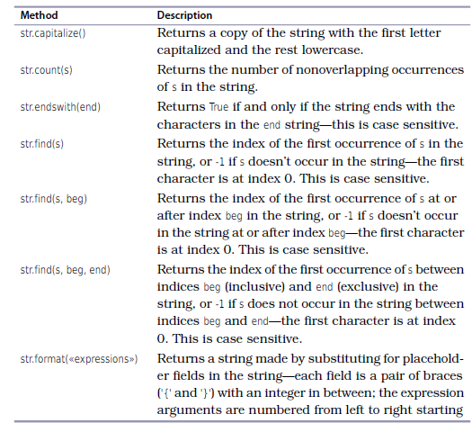
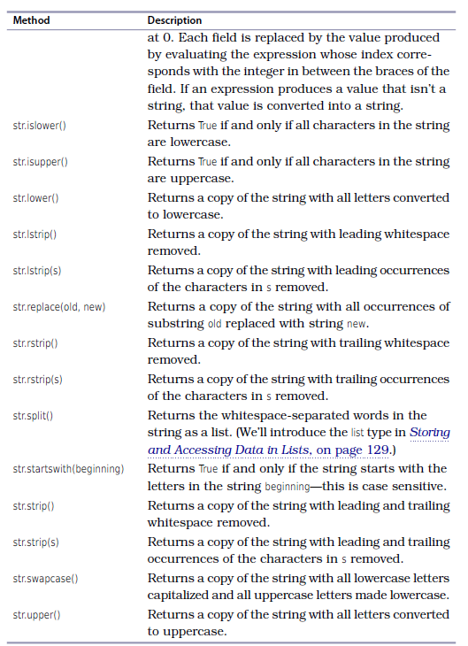

# Week2

## Week 2 Topics
- Chapters 3, 4, 5  from Practical Programming 3rd Edition By Paul Gries et al.. 
- Review
- Functions -- defining your own functions
- Working with Text/Strings
- Making Choices/Flow Control/Conditionals

## Review
- Analogy: English grammar is a set of rules that tells us how to say things correctly. This means that if we follow the rules of English language, a person listening to us will understand our intent. Programming languages also have a set of rules that if we follow them, the computer will understand our intent and carry out our instructions. In the previous lecture, we covered some of the rules for communicating our intent to a computer, specifically using the Python programming language. 
- How do we tell Python that we want to store a value?
  - What are the rules and conventions for naming variables?
- What kinds of values can Python store?
- How do we tell Python to print what we want?
- How do we tell Python to ask us for an input and save it to a variable?
- What mathematical operators does Python understand?
- How can you tell the computer to update a variable by adding a value to the variable?  There are two ways of doing this. 


## Functions
- What is a function? https://www.mathsisfun.com/sets/function.html
- Functions are subprograms -- they are a sequence of of statements that have a name
- Functions can be executed at any point by using their name 
- Functions remove duplicated code
- Functions can call other functions
- Functions can OPTIONALLY take parameters or inputs that they can use inside the function 

### Built-in functions
- `abs(-9)` -- `-9` is the input argument. Arguments appear between the parenthesis after the function name

```
day_temperature = 3
night_temprature = 10
abs(day_temperature - night_temprature)
```

Because function calls produce values, they can be used in expressions:

```
abs(-7) + abs(3.3)
```

Functions to convert one type of variable to another
```
int(34.6)
int(-4.3)
float(21)
str(21)
```

The Round function can round floats
```
round(3.8)
round(3.3)
round(3.5)
round(-3.3)
round(-3.5)
```

The round function can take an OPTIONAL second argument

```
round(3.141592653,2)
```

The `help(fxn)` function gives information about a function

```
help(round)
help(pow)
```

Using the `pow` function
```
pow(2, 4)
pow(2, 4, 3)
```

We can also use function calls as arguments to other functions:

```
pow(abs(-2), round(4.3))
```

You can use the `id()` function to find the memory address of objects. 

```
id(-9)
id(23.1)
shoe_size = 8.5
id(show_size)
```

Some other useful functions
```
min(2, 3, 4)
max(2, -3, 4, 7, -5)
max(2, -3, min(4, 7), -5)

```

### Defining your own functions
- The build-in functions that Python provides do basic tasks. We can write our own functions that can execute complicated sequence
of instructions. Your functions will be made up of Python operators and built-in Python functions.

#### Designing New Functions: A Recipe
- What do you name the function?
- What are the parameters, and what types of information do they refer to?
- What calculations are you doing with that information?
- What information does the function return?
- Does it work like you expect it to? -- We will not cover in this class. 


```python
def f(x):
    squared_x  = x * x
    return squared_x
```

```python
def f(x):
    squared_x = x ** 2
    return squared_x
```

```python
def f(x):
    squared_x = pow(x, 2)
    return squared_x
```

```python
def f(x):
    return x**2
```

```python
def f(x):
    return pow(x, 2)
```


#### Variations in functions
- No input; no output; example -- print something
- One or more input; no output; example -- print the input
- One or more input: one or more output; example -- take two numbers and return their sum
- No input; one or more output; example -- a random number
- Function Exercises 1-12


## Strings
- In Python, text is represented as a string, which is a sequence of characters (letters, digits, and symbols).
- In Python, we indicate that a value is a string by putting either single or double quotes around it.

### Operations on Strings
- `len()` -- to get length of a string
- `+` -- can add strings, but not str and type float or int
- `*` -- to repeat a string 
- `+=` -- add to another string and save value
- `int(3)`
- `float(3.4)`

### Simple examples

```python
'Aristotle'
"Issac Newton"

scientist = 'Issac Newton'
print(len(scientist))


'Alan Turning' + ' ' + 'Grace Hopper'

'NH' + 3 # This will not work. You cannot add a str and int type. 

'Four score and ' + str(7) + ' years ago'

int('0')
int('11')
int('-324')
float('-324.40')

'AT' * 5

'-' * 5

```

### Using Special Characters in Strings
- How would you put a single quote inside a string that is declared using a single quote?
- `'\\'` -- how would you print `/\/\`
- `'\n'`
- `'\''`
- `'\"'`
- `'\t'` -- useful for parsing TSV files


### Printing in Python
```python
print('abbcd', 2, 3)
```


### Getting information from the Keyboard
```python
number = input('Please enter a number: ')
```

```python
number = int(input('Please enter a number: '))
```

```python
def convert_celsius(fahrenheit):
    return (fahrenheit - 32.0) * 5.0 / 9.0    
```

```python
def convert_celsius():
    fahrenheit = float(input('Please enter temperature in Fahrenheit: '))
    celsius =  (fahrenheit - 32.0) * 5.0 / 9.0  
    print('The temperature in celsius is: ', celsius) 

```

### String Formatting
- The fastest and latest way to do string formatting is using the F-strings (https://realpython.com/python-f-strings/)
- ``` python
  PI = 3.14159265359 
  print(f'{PI:.2f}')
  ```
- But you have to know the other ways so you can read older code or use these ways if you have to use an older version of Python
  - ``` python
    PI = 3.14159265359 
    name = 'PI'
    print('%s is %.2f' % (name, PI))  # oldest way format specifier is <width>.<precision><type>
    print(('{0} is {1:.2f}'.format('PI', PI)) ) # older way {<index>:<format-specifier>} where the format specifier is <width>.<precision><type>
    print(f'{name} is {PI:.2f}') # newest way
    ```

- Go Over: https://pyformat.info/

```python
class_number = 'EAS503'
class_size = 113
class_average = 92.3

my_str * 10

x = '-'
x * 10

my_str = 'EAS503'
my_int = 113
my_float = 92.3

line1 = 'This is the first line.\n'
line2 = 'This is the second line.'
lines = line1 + line2

line = 'This is the first line.\n'
line += 'This is the second line.'

# Example 1
str_format = '{}'.format(class_number)
f_string = f'{class_number}'

print(str_format)
print(f_string)

# Example 2
str_format = 'The course number is {}'.format(class_number)
f_string = f'The course number is {class_number}'

print(str_format)
print(f_string)


# Example 3 use index
str_format = 'The course number is {}. It has {} students.'.format(class_number, class_size)
str_format = 'The course number is {0}. It has {1} students.'.format(class_number, class_size)
f_string = f'The course number is {class_number}. It has {class_size} students.'

print(str_format)
print(f_string)


# Example 4 change index
str_format = 'The course number is {1}. It has {0} students.'.format(class_number, class_size)
f_string = f'The course number is {class_size}. It has {class_number} students.'

print(str_format)
print(f_string)

# Example 5 adding a float
str_format = 'The course number is {0}. It has {1} students. The class average is {2}'.format(class_number, class_size, class_average)
f_string = f'The course number is {class_size}. It has {class_number} students. The class average is {class_average}.'

print(str_format)
print(f_string)

# Example 6 specify number of spaces to use -- width
str_format = 'The course number is {0:10}. It has {1:10} students. The class average is {2:10}'.format(class_number, class_size, class_average)
f_string = f'The course number is {class_size:10}. It has {class_size:10} students. The class average is {class_average:10}.'

print(str_format)
print(f_string)


# Example 7 right align
str_format = 'The course number is {0:>10}. It has {1:>10} students. The class average is {2:>10}'.format(class_number, class_size, class_average)
f_string = f'The course number is {class_size:>10}. It has {class_size:>10} students. The class average is {class_average:>10}.'

print(str_format)
print(f_string)


# Example 7 left align
str_format = 'The course number is {0:<10}. It has {1:<10} students. The class average is {2:<10}'.format(class_number, class_size, class_average)
f_string = f'The course number is {class_number:<10}. It has {class_size:<10} students. The class average is {class_average:<10}.'

print(str_format)
print(f_string)


# Example 8 center align
str_format = 'The course number is {0:<10}. It has {1:<10} students. The class average is {2:<10}'.format(class_number, class_size, class_average)
f_string = f'The course number is {class_number:<10}. It has {class_size:<10} students. The class average is {class_average:<10}.'

print(str_format)
print(f_string)

```


- String Exercises 1-9


- https://scipython.com/book/chapter-2-the-core-python-language-i/string-representation-of-integers-with-comma-separated-thousands/
```python
title = '|' + '{:^51}'.format('Cereal Yields (kg/ha)') + '|'
line = '+' + '-'*15 + '+' + ('-'*8 + '+')*4
row = '| {:<13} |' + ' {:6,d} |'*4
header = '| {:^13s} |'.format('Country') + (' {:^6d} |'*4).format(1980, 1990,
                                                                  2000, 2010)
print('+' + '-'*(len(title)-2) + '+',
      title,
      line,
      header,
      line,
      row.format('China', 2937, 4321, 4752, 5527),
      row.format('Germany', 4225, 5411, 6453, 6718),
      row.format('United States', 3772, 4755, 5854, 6988),
      line,
      sep='\n')
```


## String methods




## Making Choices/Flow Control/Conditionals

- So far we have only written small programs that are a sequence of instructions. Sometimes you have to alter the sequential flow of a program to suit the needs of a particular situation.
- When strings are compared, they are compared lexicographic, meaning strings are put into alphabetical order and uppercase comes before lowercase.
- The conditional operator converts the conditional into a boolean, which is a basic Python data type.
- `bool` datatype only has two values: `True` or `False`
- There are only three Boolean operators: `and`, `or`, and `not`.

### Truthiness and Falsiness 
- Things that are false on their own
    - `None` (basic data type)
    - `False` (basic data type)
    - Any empty sequence: `''`, `[]`, `()`
    - Any zero value: 0, 0.0
    - Anything whose `len()` returns 0
    - Empty objects
    - Everything else is True 
      

### Boolean Operators

- Assume `a=1` and `b=1`

| Boolean Operators | What it does?                                | Example       |
|----|---------------------------------------------|---------------|
| == | True if a has the same value as b           | a == b #True  |
| != | True if a does not have the same value as b | a != b #False |
| >  | True if a is greater than b                 | a > b # False |
| <  | True if a is less than b                    | a < b # False |
| >= | True if a is greater than or equal to b     | a >= b # True |
| <= | True if a is less than or equal to b        | a <= b # True |

### Logical Operators

| Operator | What it does?                                        | Example                                                                   |
|----------|------------------------------------------------------|---------------------------------------------------------------------------|
| `and`    | True if both a AND b are true (logical conjunction)  | if is_teacher and is_active:   print('You can access')                    |
| `or`     | True if either a OR b are true (logical disjunction) | if is_superuser or (is_teacher and is active):    print('You can access') |
| `not`    | True if the opposite of a is true (logical negation) | if not is_superuser:   print('You cannot access')    


### Examples
```python

not True
not False

True and True
False and False
True and False
False and True


True or True
False or False
True or False
False or True

```


```python
cold = True
windy = False

(not cold) and windy # It is not cold and windy

not (cold and windy) # 


```


### Relational Operators
- `==` Equal to 
- `!=` Not equal to
- `<` Less than
- `>` Greater than
- `<=` Less than or equal to
- `>=` Greater than or equal to

- These operators evaluate to True or False depending on the values you give them.
- Conditionals are used to instruct computer to make a decision. 

```python
45 > 34
45 > 79
45 < 79
45 < 34

23.1 >= 23
23.1 >= 23.1
23.1 <= 23.1
23.1 <= 23

67.3 == 87
67.3 == 67
67.0 == 67
67.0 != 67
67.0 != 23

```
###  Combining Comparisons

```python
x = 2
y = 5
z = 7
x < y and y < z

(x < y) and (y < z) # better

```

```python
x = 3
(1 < x) and (x <= 5)

x = 7
(1 < x) and (x <= 5)


x = 3 
1 < x <= 5 # You can chain comparisons

3 < 5 != True 
(3 < 5) and (5 != True)

3 < 5 != False
(3 < 5) and (5 != False)
```

### String Comparisons
```python
'A' < 'a'
'A' > 'Z'
'abc' < 'abd'
'abc' < 'abcd' # shorter is less

```

```python
'Jan' in '01 Jan 1838'

'Feb' in '01 Jan 1838'

'a' in 'abc'

'A' in 'abc'

```


### Choosing which statements to execute

```Python
if some condition is True:
    do something
elif some other condition is True: # else if 
    do something
elif some other condition is True: # else if 
    do something
elif some other condition is True: # else if 
    do something
else:
    do something 
```
- colons are important and indentation matters
- can have many elif tests
- do not need else
- conditions can be nested


#### Example
| pH Level | Solution Category |
|----------|-------------------|
| 0-4      | Strong acid       |
| 5-6      | Weak acid         |
| 7        | Neutral           |
| 8-9      | Weak base         |
| 10-14    | Strong base       |

```python
ph = float(input('Enter the pH level: '))
if ph < 7.0:
    print(ph, " is acidic.") #indentation important
```

```python
ph = float(input('Enter the pH level: '))
if ph < 7.0:
    print(ph, " is acidic.")
    print('You should be careful with that!') #indentation is important
```


```python
ph = float(input('Enter the pH level: '))
if ph < 7.0:
    print(ph, " is acidic.") #indentation important

if ph > 7.0:
    print(ph, " is basic.") 
```

```python
ph = float(input('Enter the pH level: '))
if ph < 7.0:
    print(ph, " is acidic.") #indentation important
elif ph > 7.0:
    print(ph, " is basic.") 
```

```python
ph = float(input('Enter the pH level: '))
if ph < 7.0:
    ph = 8.0 #indentation important

if ph > 7.0:
    print(ph, " is basic.") 
```


```python
ph = float(input('Enter the pH level: '))
if ph < 7.0:
    ph = 8.0  #indentation important
elif ph > 7.0:
    print(ph, " is basic.") 
```


```python
ph = float(input('Enter the pH level: '))
if ph < 7.0:
    ph = 8.0  #indentation important
elif ph > 7.0:
    print(ph, " is basic.") 
```

```python
compound = input('Enter the compound: ')
if compound == 'H20':
    print('Water')
elif compound == 'NH3':
    print('Ammonia')
elif compound == 'CH4':
    print('Methane')
else:
    print('Unknown compound')


```


#### Nested if statements
```python
value = input('Enter the pH level: ')
if len(value) > 0:
    ph = float(value) 
    if ph < 7.0:
        print(ph, " is acidic.")
    elif ph > 7.0:
        print(ph, " is basic.")
    else:
        print(ph, " is neutral.")

else:
    print('No pH value was given!')

```


```python
if age < 45:
    if bmi < 22.0:
        risk = 'low'
    else:
        risk = 'medium'
else:
    if bmi < 22.0:
        risk = 'medium'
    else:
        risk = 'high'

```

```python
young = age < 45
slim = bmi < 22.0
if young:
    if slim:
        risk = 'low'
    else:
        risk = 'medium'
else:
    if slim:
        risk = 'medium'
    else:
        risk = 'high'
```

```python
young = age < 45
slim = bmi < 22.0
if young and slim:
    risk = 'low'
elif young and not slim :
    risk = 'medium'
elif not young and slim:
    risk = 'medium'
elif not you and not slim:
    risk = 'high'
```

- What is wrong with the following code?
```python
ph = 2
if ph < 7.0:
    print(ph, ' is acidic')
elif ph < 3.0:
    print(ph, ' is VERY acidic! Be careful.')
```

```python
# Implement the min() function for three inputs

number1 = int(input('Enter first integer: '))
number2 = int(input('Enter second integer: '))
number3 = int(input('Enter third integer: '))

minimum = number1  

if number2 < minimum:
    minimum = number2

if number3 < minimum:
    minimum = number3

print('Minimum value is', minimum)
```


https://www.analyzemath.com/Equations/solve-quadratic-equations-using-discriminants.html